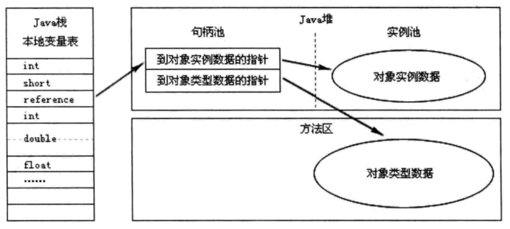
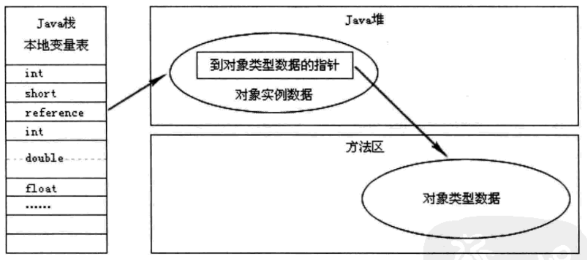
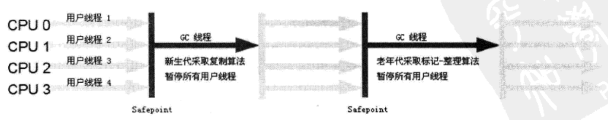
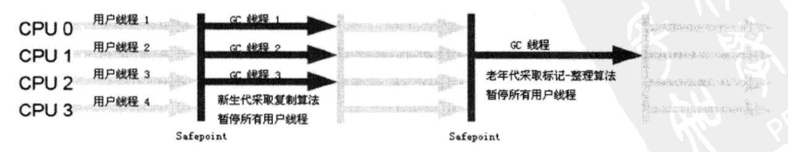

### 190224

* Java技术体系包括以下几个部分：
  * Java编程语言
  * Java标准类库
  * 来自商业机构或开源社区的第三方类库
  * JVM
  * .class文件结构
其中，Java编程语言、Java标准类库和JVM称为JDK；Java标准类库和JVM称为JRE。

* Java程序在运行时，内存分为如下几个区域：
  * 程序计数器，当某个线程执行字节码指令时，通过计数器选取下一条指令。程序计数器是线程私有的，而且在native方法执行过程中，程序计数器是不存在的，因为程序计数器只能用于指示**字节码指令**的位置。
  * 虚拟机栈，也是线程私有的，生命周期和线程一样。它用来描述Java方法的内存模型，方法开始和结束就对应了一个栈帧在虚拟机栈中的push和pop。栈帧是方法运行期的基础数据结构，用来保存方法的出入口信息、方法中的局部变量等等，之前经常听到的“对象保存在堆，变量保存在栈”这种说法，其中的“栈”，指的就是虚拟机栈中的保存局部变量的那一部分（也就是局部变量表，或者称本地变量表）。局部变量表中不仅可以保存8中基本类型的值，还可以保存reference类型和returnAddress（字节码指令地址）类型。long和double占用两个单位空间，其他类型都是占用一个单位。对于一个完全确定的Java方法，它所需要的局部变量表的大小也是确定的，所以局部变量表的大小在编译期间就能确定，而且这个大小在运行期不会变。虚拟机栈可能会出现两种异常，一个是喜闻乐见的StackOverflowError，写递归的时候容易出现。从虚拟机栈的角度来说，就是栈中放了太多的栈帧（方法层级太多了）或一个帧太庞大了（局部变量太多了），超出了栈最大字节数；还有就是OutOfMenoryError，往栈中push栈帧的时候，如果栈太短，就要找内存扩展，如果找不到可用的内存，就出现该错误。虚拟机栈是不可扩展的，整个生命周期容量都是固定的。
  * 本地方法栈，它的作用和虚拟机栈相似，只不过虚拟机栈给Java方法提供服务，而本地方法栈给native方法提供服务。不同的虚拟机对本地方法栈有不同的实现，甚至有虚拟机将两个栈合二为一。
  * 堆，最大也是最重要的一块区域，被所有线程共享，虚拟机启动时创建，作用是保存对象实例和数组，GC管的也正是这一块区域。从GC角度看，堆还可以细分（怎么分以后会学到）。从内存分配的角度看，堆中会分出一部分空间给线程私有，也就是线程私有的分配缓冲区了。堆可以在物理上不连续，跟链表一样，逻辑上连续即可，堆的大小在运行期是可变的，如果堆爆满需要扩展，但又找不到可用的内存扩展，就会出OutOfMemoryError错误。
  * 方法区，用于保存已被虚拟机加载的类、常量、静态变量和字节码指令等数据。垃圾回收行为在这个区也有，但是很少，主要针对类型的卸载和常量池的回收。和堆一样可以物理上不连续，一样会抛OutOfMemoryError错误。
    * .class文件中的常量部分，记录了编译后产生的各种字面量和符号引用。在类加载后，会把这部分数据写到**运行时**常量池中，运行时常量池是方法区中的一部分。运行时常量池可以在运行时动态扩展，也就是说，运行时可以动态产生新的常量，并保存在运行时常量池中（.class文件中没有）。举个栗子，`"hello world"`这种通过字面值定义的字符串对象，就会被记录在.class文件中，并在运行时写入到运行时常量池中，就算代码中有一千次一万次`"hello world"`，该字符串对象在常量池中也只有一个，所以字符串字面值是可以直接用`==`比较的，但是`new String("hello world")`这种字符串对象不行！！其实字符串比较最稳妥的肯定不会错的方式还是用equals方法。关于动态操作运行时常量池，可以了解一下String类的intern()方法，用到不多，其实就是在运行时常量池中查找指定的字符串，找到就返回，找不到就往池里加，再把池中新加的字符串的引用返回。
    * .class文件中的类信息部分，描述了类的名称、访问修饰符、字段描述和方法描述等信息，类加载后，这些信息也会写到方法区中。除此之外，动态加载的类的信息也会写到方法区中，比如涉及到Java原生的动态代理，CGlib等。对于Spring应用，往往涉及到大量动态生成的类，需要更大的方法区容纳。
  * 直接内存，直接内存其实是在虚拟机外，是native内存，但堆中可以创建一个DirectByteBuffer对象来引用和操作直接内存，这种高端玩法在某些情况下可以显著提高性能，比如NIO。同理直接内存也会OutOfMemoryError。

* 访问Java对象的两种方式：
  * 通过句柄访问，这个图说的很清楚了：
    
    好处是移动对象的时候，改句柄中的*到对象实例数据的指针*就行了，其他都不用改；坏处是多了一次指针定位的开销。
  * 通过指针访问，比较直接，上图：
    
    好处是比较快，一次定位就能找到，坏处是移动对象的时候要去本地变量表里改reference。HotSpot用的是这种方式。

### 190225

* 设置JVM参数：java [JVM参数] 字节码文件 [命令行参数]
* JVM参数：
  * -Xms1000m：堆最小为1000M。
  * -Xmx1000m：堆最大为1000M，-Xms和-Xmx这两个设置为一样可以使堆的大小固定，不可扩展。
  * -XX:+HeapDumpOnOutOfMemoryError：出现OutOfMemoryError错误时，给堆拍个照保存下来事后分析，可以用JProfiler或MAT之类的内存映像分析工具分析。
  * -Xss128k：虚拟机栈容量为128k字节，HotSpot虚拟机不区分虚拟机栈和本地方法栈。
  * -XX:PermSize10m和-XX:MaxPermSize10m：设置方法区的初始大小和最大容量，在JDK7以后这两个参数已废弃（去永久代，后面会学到）。
* 导致OOM的深层次原因主要有两个：
  * 内存溢出：说白了就是内存不够用了，可以通过JVM参数把堆调整到更大，或者给机器换个大一点的内存:)，或者优化一下，缩短一些对象的生命周期，尽快把内存腾出来给别人用。
  * 内存泄露：一些对象已经没有用了，已经是垃圾了,却由于种种原因没有清理掉，这样的垃圾越积越多，可用内存就越来越少，然后就OOM了。

### 190227

* 垃圾回收技术要解决的三个问题：那些内存需要回收？何时回收？怎么回收？

* 引用计数算法：给对象加个引用计数器，有一个地方引用它，计数器加1；引用失效，计数器减1。计数器为0，这个对象就算凉了。致命缺陷就是循环引用问题无法解决，JVM堆不采用这种简单的算法。
* 根搜索算法：从一系列名为"GC Root"的对象出发，能通过引用链（有向图）到达该对象，说明该对象是活的，否则，就是不可用的。在Java语言中，可以作为GC Root的对象有：
  * 栈帧中的本地变量表引用的对象
  * 方法区中常量和类静态字段引用的对象
  * native方法中引用的对象
* Java中，引用不是指针，不能简单理解为指针，实际上Java引用分4种，按强度由强到弱分（带权重的有向图）：
  * 强引用：最常见的引用，比如`Object obj = new Object()`，只要强引用还在，它所引用的那个对象一定不会被回收。
  * 软引用：在即将发生内存溢出的时候，软引用的对象就会被牺牲掉，如果还是不够用，那就真的内存溢出了。在平时内存不紧张的情况下，软引用对象正常存在。
  * 弱引用：弱引用对象只能生存到下一次垃圾收集发生之前。
  * 虚引用：虚引用对引用的对象的生命周期没有任何影响，也不能通过虚引用访问对象。虚引用的唯一目的是当关联的对象被清理了，可以收到通知（PhantomReference）。
* 二次标记过程：
  1. 根据根搜索算法和4种引用的特点，把不可达的对象标记出来，这是第一次标记。
  1. 在第一次标记的对象中筛选，如果没有重写finalize()方法或finalize()已被执行过，则直接判定可回收；否则该对象加到F-Queue中。
  1. 虚拟机开个低优先级的Finalizer线程，专门执行F-Queue队列中的finalize()方法。
  1. 筛选F-Queue中的对象，如果对象重新可达（在finalize()方法中重新加入引用链），就做标记，这是第二次标记。因为finalize()不能执行两次，所以只能自救一次。
  1. 把第二次标记的对象踢出F-Queue，剩下的判定可回收。
* 其实finalize()能做的事，完全可以用`try...catch...finally`做，而且做的更好更及时，自己写代码的时候千万不要出现重写finalize()这种奇葩操作。在一些老古董的代码中万一看到重写finalize()，能看懂，不懵逼，就行了。
* 方法区的GC相对就简单了，主要是清理废弃常量和无用的类：
  * 废弃常量的清理就是最简单的引用计数，因为常量没有循环引用的问题。比如字符串字面值，循环引用不存在的。
  * 判定一个类是无用的，有三个标准：
    * 不存在该类的任何实例
    * 该类的ClassLoader已回收
    * 该类的Class对象没有在任何地方被引用
    然额无用的类只是有可能被清理，实际上还不一定，默认是会清理的，可以加-Xnoclassgc参数设置成不清理。在大量使用反射和动态代理的场景下还是清理吧。

### 190301

* 标记-清除算法，也就是上面个提到的二次标记过程，是最基础的垃圾回收算法，主要有两点缺陷，效率问题和空间问题，也就是说清理后会产生大量的零碎不连续的内存碎片，进而导致之后分配大对象的时候找不到足够大的连续内存空间而不得不提前触发另一次垃圾收集动作。
* 复制算法，将内存划分为相同的两块，先使用其中的一块，如果不够用了，就把这一块中存活的对象全部复制到另一块上，再把这一块全部清空，接着使用另一块，如此循环。代价就是内存小了一半，代价太大了，而且存活对象较多的时候，复制过去效率也挺低的。HotSpot虚拟机在新生代（什么是新生代后面会学）中使用的是一种变体的复制算法，将新生代内存默认划分为8:1:1的三块，8称为Eden空间，1称为Survivor空间，每次只使用Eden空间和一块Survivor空间，也就是使用90%，浪费掉10%，还算可以接受。当这90%满了，就把存活的对象复制到剩下的那个Survivor空间里，然后清空那90%。这么搞可行的一个前提是清理新生代中的对象大部分都死了，存活的对象占比不到10%。如果清理的时候百分之二三十的对象存活（存活的对象稍微多了点），导致剩下的那块Survivor空间不够放，则会把多出来的存活的对象转移到老年代。
* 标记-整理算法，针对老年代对象存活率较高的特点提出，在二次标记后，把存活的对象往一端移动，再把边界外的空间全部清理。
* 分代收集算法，JVM根据对象存活周期的不同把堆分为老年代和新生代，老年代中对象存活率较高，适合使用标记-整理算法；新生代中对象存活率较低，适合使用变体复制算法。

* Serial/Serial Old收集器，开始清理就会把用户的工作线程暂停，清理结束才会恢复。清理工作以单线程的方式进行。看上去好像很low很鸡肋，但也有优点，就是实现简单，执行高效。因为不需要考虑内部GC线程和GC线程之间的协调，也不需要考虑工作线程对清理工作的影响。
  
* ParNew收集器，专用于新生代，也可以看做是Serial收集器的多线程版本。可以通过-XX:+UseParNewGC参数强制使用该收集器。
  
* Parallel Scavenge收集器，和ParNew类似，一样专用于新生代，一样使用复制算法，一样多线程，一样会暂停工作线程。区别在于Parallel Scavenge收集器更关注吞吐量，吞吐量 = 执行用户代码占用的时间 / CPU总消耗时间的比值，这个值当然是越高越好，高吞吐量意味着高效率地利用CPU时间。可以通过-XX:GCTimeRatio参数设置吞吐量，收集器将尽量保证该吞吐量，举个栗子，-XX:GCTimeRatio19表示最低吞吐量为19 / (1 + 19) == 95%，默认值是-XX:GCTimeRatio99，也就是最低吞吐量99%。Parallel Scavenge收集器支持自适应的调节策略，通过参数-XX:+UseAdaptiveSizePolicy启用，说白了，就是小白不懂收集器内部原理，没有相关调优经验，手工调优存在困难（直接设置新生代大小，Eden和Survivor区的比例等这些很细节的参数），就可以直接启用这个参数，让虚拟机替你动态调优，尽力达到你设定的吞吐量。Parallel Scavenge收集器是JDK7和8的默认新生代收集器。
* Parallel Old收集器，老年代版本的Parallel Scavenage收集器，使用多线程和标记-整理算法。JDK7和8的默认老年代收集器。
* GMS收集器，传说中的低停顿收集器，暂停工作线程的时间极短甚至可以忽略不计的收集器，可以做到和工作线程真正并行，之前的收集器打个比方就是“你妈打扫房间你必须出去”，GMS就是“你妈打扫房间你可以待在里面甚至还可以乱扔纸屑”。可惜GMS有一些致命的问题，比如实现复杂，会和工作线程争抢CPU资源，碎片化严重等等，目前已在JDK9中废弃，不提倡使用。
* 注意Serial Old（单线程标记整理）可以和Serial（单线程复制）、ParNew（多线程复制）和Parallel Scavenge（多线程复制）搭配使用。Parallel Old（多线程标记整理）只能和Parallel Scavenge（多线程复制）搭配使用。
* G1收集器可能是目前最先进的垃圾收集器，基于收集-整理算法，不会产生空间碎片，而且可以精确控制暂停时间到毫秒（-XX:MaxGCPauseMillis=200，保证不超过最长暂停时间，不存在尽力不尽力这一说）。G1收集器弱化了老年代新生代的概念，将整个堆分成等分成若干区（类似磁盘分区），对这些区中的垃圾堆积情况进行跟踪，维护一个优先级列表，在指定的时间内优先清理垃圾最多的区（Grabage First），以到达最大效率。G1收集器是JDK9的默认收集器，在JDK7和8中也有，通过-XX:+UseG1GC启用。

### 190303

* JVM相关参数：
  * -XX:+PrintGCDetails，打印GC日志。
  * -XX:Xmn10m，新生代大小10m。
  * -XX:SurvivorRatio=8，Eden空间和Survivor空间的比例是8:1。
  * -XX:PretenureSizeThreshold=3145728，大对象和小对象的界限是3145728字节，这个参数只有Serial和ParNew收集器认识。
  * -XX:MaxTenuringThreshold=2，设置对象晋升老年代的年龄阈值为2。
* 新生代GC就是Minor GC，老年代GC称为Major GC或Full GC，Full GC比Minor GC慢十倍以上。

* 对象分配规则：
  1. 小对象在Eden空间中分配，如果放不下，就触发Minor GC，再分配。
  1. 大对象直接在老年代中分配。
  1. 对象刚在Eden出生，就是0岁，经历过1次Minor GC存活下来且最后位于Survivor，就涨了一岁。当对象到一定岁数（默认15）就会晋升到老年代。