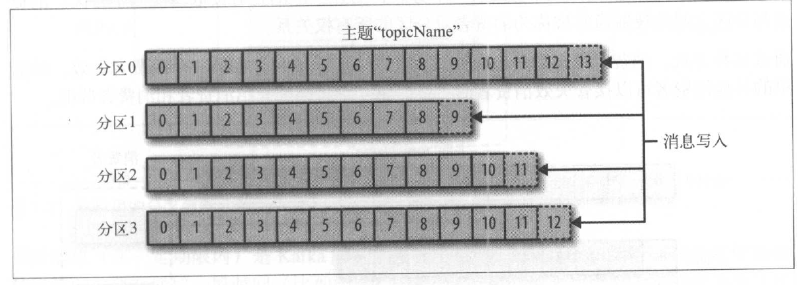
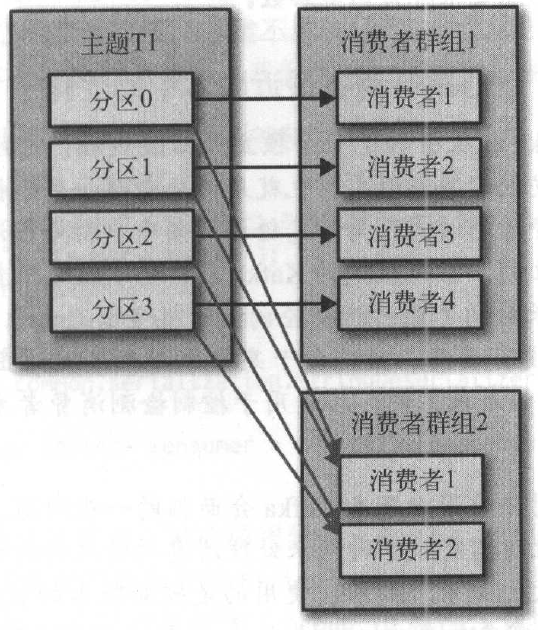
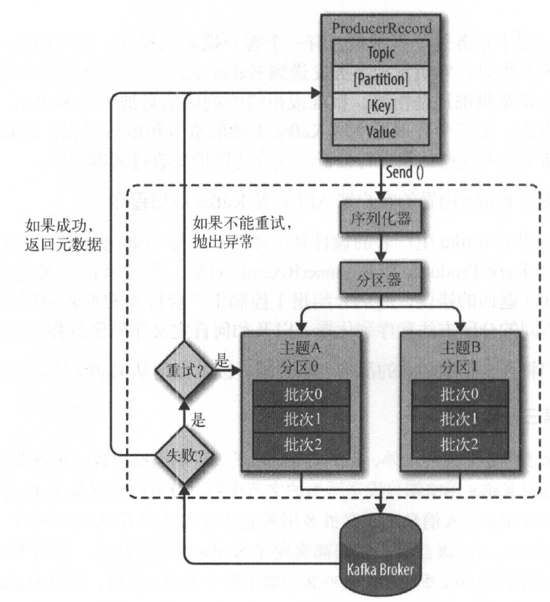

# Kafka简明教程

## Kafka作用

* 服务解耦
* 缓冲，提高吞吐量和容错性

## kafka使用场景

* 仪表盘（监控）程序
* 日志集散中心（JobManagement）

## 核心概念

* 消息：kafka的基本数据单元，类似数据库里的一个“数据行”或一条“记录”。消息由topic, [partition, key,] value组成。
* 批次：主题和分区相同的一组消息。为了提高效率，消息以批次为单位写入kafka。
* 消息模式：json, xml, avro等。
* 主题：消息通过主题进行分类，类似数据库里的“表”。
* 分区：一个主题可以分为若干分区，kafka通过分区实现伸缩性，分区可以分布在不同的机器上，也就是说，一个主题可以横跨多个服务器。



* 生产者：创建和发布消息的一方。
* 消费者：订阅和读取消息的一方。
* 偏移量：消息元数据之一，自增整数。在给定分区中，消息的偏移量是唯一的。
* 拉取偏移量：特定消费者对特定分区的消费进度。拉取偏移量只与特定的消费者关联，保存在消费者本地。
* 提交偏移量：每次消息消费后，需要提交偏移量。在提交偏移量时，一般会使用拉取偏移量的值作为提交偏移量提交到分区。提交偏移量只与特定的分区关联，保存在一个特殊主题__consumer_offsets中。
* 消费者群组：订阅同一个主题的若干个消费者可以组成消费者群组。群组能保证**一个分区只能被群组内一个消费者使用**（消费者对分区的所有权关系）。



## 生产者

### 生产者发送消息过程



### 生产者重要配置项

```java
Properties kafkaProducerProps = new Properties();
// 必须要配置的项
kafkaProducerProps.put("bootstrap.servers", "broker1:9092,broker2:9092");
kafkaProducerProps.put("key.serializer", "com.xx.xx.xx.StringSerializer");
kafkaProducerProps.put("value.serializer", "com.xx.xx.xx.StringSerializer");
// 可选项
// buffer.memory 生产者内部缓冲区大小（字节）
// batch.size 批次大小（字节）
// linger.ms 生产者在批次已满或linger.ms到达上限时把批次发送出去
// client.id 生产者的id，可以是任意内容的字符串，用来标识生产者
// retries 重试次数，设为0则不重试
// max.in.flight.requests.per.connection 生产者在收到成功响应之前可以发送多少个批次
// 设为1可以保证消息是按发送的顺序写入服务器的，即使发生了重试

KafkaProducer producer = new KafkaProducer<String, String>(kafkaProducerProps);
// KafkaProducer是线程安全的，一般情况下一个实例即可，除非需要更高的吞吐量
```

### 发送消息的三种方式

* 发送并忘记

```java
ProducerRecord<String, String> record = new ProducerRecord<>("topic", "key", "value");
producer.send(record);
```

* 同步发送

```java
ProducerRecord<String, String> record = new ProducerRecord<>("topic", "key", "value");
Future<RecordMetadata> future = producer.send(record);
RecordMetadata metadata = future.get();
```

* 异步发送

```java
private static final class MyProducerCallback implements Callback {
    @Override
    public void onCompletion(RecordMetadata metadata, Exception e) {
        // 发送过程中出现异常则 e != null
    }
}
ProducerRecord<String, String> record = new ProducerRecord<>("topic", "key", "value");
producer.send(record, new MyProducerCallback());
```

### 自定义序列化器

1. 实现`Serializer<T>`接口
1. value.serializer指定为`Serializer<T>`的实现类
1. KafkaProducer和ProducerRecord使用T类型的参数

### 默认分区策略

key为null，用轮询的方式把消息均匀分布到各个分区上；key不为null，根据key的散列值把消息映射到特定分区上。在不改变分区数量的情况下，同一个key总是被映射到同一个分区上。

### 自定义分区器

1. 实现`Partitioner`接口
1. KafkaProducer的`partitioner.class`属性设置为`Partitioner`的实现类

## 消费者

### 分区再均衡

分区的所有权从一个消费者移动到另一个消费者的过程称为再均衡。再均衡期间，当前群组会整体不可用，且上一个消费者的拉取偏移量会丢失。应尽量避免不必要的再均衡。

### 触发再均衡的条件

* 每个消费者都有一个后台的心跳线程，每隔一段时间(`heartbeat.interval.ms`)向群组协调器broker发送心跳。若群组协调器超过一定时间(`session.timeout.ms`)没有收到心跳，就认为该消费者已死亡，将其移出群组并触发再均衡。
* 消费者超过一定时间(`max.poll.interval.ms`)没有调用poll方法也会被移出群组并触发再均衡。
* 新消费者第一次调用poll时加入群组。
* 消费者调用close主动关闭时退群。

### 消费者的正确使用姿势

#### 创建

```java
Properties props = new Properties();
// 必须要配置的项
props.setProperty("bootstrap.servers", "broker1:9092,broker2:9092");
props.setProperty("key.deserializer", "com.xx.StringDeserializer");
props.setProperty("value.deserializer", "com.xx.StringDeserializer");

// 可选项
// group.id 指定所属群组
// heartbeat.interval.ms
// session.timeout.ms
// max.poll.interval.ms
// auto.offset.reset 有三个值earliest, latest和none，在分区没有 提交偏移量 的
// 情况下，earliest从偏移量0开始消费，latest从最新偏移量开始消费，none抛出异常，默认是latest
// enable.auto.commit 是否自动提交偏移量，设为true，消费者会以一定时间间隔提交当前的拉取偏移量
// 默认为true，但建议设为false，因为自动提交会有消息重复的风险
// partition.assignment.strategy 分区分配给消费者的策略，Range 连续分配 RoundRobin 逐个分配，可以自定义
// max.poll.records poll一次能拿到的最大消息数量

// KafkaConsumer非线程安全
KafkaConsumer<String, Person> consumer = new KafkaConsumer<>(props);
```

#### 订阅和轮询

* at-least once: 保证消息不丢，但可能重复。消费者已经处理完了，但是offset还没提交，此时消费者挂了，就会导致消费者重复消费。

```java
class RebalanceHandler implements ConsumerRebalanceListener {
    @Override
    public void onPartitionsRevoked(Collection<TopicPartition> partitions) {
        // sync commit offset
    }

    @Override
    public void onPartitionsAssigned(Collection<TopicPartition> partitions) {
        // do nothing
    }
}

consumer.subscribe(Collections.singletonList("test.topic"), new RebalanceHandler());

try {
    while (true) {
        ConsumerRecords<String, Person> records = consumer.poll(100); // throws WakeupException
        for (ConsumerRecord<String, Person> record : records) {
            // process record
            storeRecordInDB(record.key(), record.value());
        }
        consumer.commitAsync();
    }
} catch (WakeupException ignored) { // consumer.wakeup() 触发此异常使退出循环
} finally {
    try {
        consumer.commitSync();
    } finally {
        consumer.close();
    }
}
```

* exactly once: 保证消息不丢失也不重复。处理消息和提交偏移量作为一个原子事务。比较常见的做法是用数据库事务实现。

```java
class RebalanceHandler implements ConsumerRebalanceListener {
    @Override
    public void onPartitionsRevoked(Collection<TopicPartition> partitions) {
        commitDBTransaction();
    }

    @Override
    public void onPartitionsAssigned(Collection<TopicPartition> partitions) {
        for (TopicPartition partition : partitions) {
            consumer.seek(partition, getOffsetFromDB(partition));
        }
    }
}

consumer.subscribe(Collections.singletonList("test.topic"), new RebalanceHandler(consumer));

try {
    while (true) {
        ConsumerRecords<String, Person> records = consumer.poll(100); // throws WakeupException
        beginDBTransaction();
        for (ConsumerRecord<String, Person> record : records) {
            // process record
            storeRecordInDB(record.key(), record.value());
            storeOffsetInDB(record.topic(), record.partition(), record.offset());
        }
        commitDBTransaction();
        // 不需要提交偏移量给kafka了
    }
} catch (WakeupException ignored) { // consumer.wakeup() 触发此异常使退出循环
} finally {
    consumer.close();
}
```

### 反序列化器

1. 实现`Deserializer<T>`接口
1. value.deserializer指定为`Deserializer<T>`的实现类
1. KafkaConsumer和ConsumerRecord使用T类型的参数
