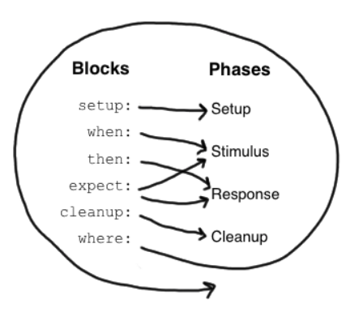

 # Spock 文档

 ## 说明

 本文档为 Spock 官方文档的大致翻译，很多地方没有直接对应，官方文档参考：
 http://spockframework.org/spock/docs/1.1-rc-1/all_in_one.html

 ## Groovy 语言基础

 Spock 是基于 Groovy 的测试框架。Groovy 是运行在 JVM 上的脚本语言，语法和 Java 兼容，可以理解为脚本化的 Java。Groovy 教程参考：
 https://www.w3cschool.cn/groovy

 ### Groovy 和 Java 的一些区别
 
1. public 修饰符在 Groovy 中不是必须的。

1. Groovy 支持范围类型，比如 `1..3` 相当于 Java 中的数组 `{ 1, 2, 3 }`；`1.2..3` 相当于 Java 中的数组 `{ 1.2, 2.2 }`；`1..<3` 相当于数组 `{ 1, 2 }`；`'a'..'z'` 相当于所有小写字母的字符集合。范围类型是可迭代的。

1. Groovy 中的数组（列表）表示为 `[ v1, v2 ]`，用中括号括起。

1. Groovy 中的字典可表示为 `[ k1: v1, k2: v2 ]`，键和值的类型都可以随意，可以迭代键值对。空字典 `[: ]`。

1. Groovy 支持类型自动推断，使用关键字 `def`，比如 `def var = value;`。

1. Groovy 的方法的返回值可以指定为某一类型，也可以指定为 `def`。

1. Groovy 的方法支持默认参数。

1. 一个 Groovy 脚本就是一个类，定义在脚本中的类可以理解为内部类，直接定义在脚本中的方法（或者说是函数）可以当成脚本类的成员方法。

1. 字符串中 `$xxx` 可以直接引用变量。

1. 字符串中 `${xxx.xxx()}` 可以直接引用方法的返回值。

1. Groovy 支持范围下标，负数下标。

1. Groovy 可以使用 Java I/O 的所有类，除此之外还有 I/O 操作的快捷方式：

    * 对文件进行逐行处理：

      ```
      // java.io.File
      new File(filepath).eachLine {
          line -> processLine(line)
      };
      ```

    * 获取文件的整个文本：

      ```    
      // java.io.File
      new File(filepath).text
      ```

    * 写入文件：

      ```
      new File(filepath).withWriter("UTF-8") {
          writer -> writer.write(str)
      };
      ```

    * 获取文件大小（单位：字节）：
      
      ```
      new File(filepath).length()
      ```

    * 判断路径是文件还是目录：
      
      ```
      file.isDirectory()
      file.isFile()
      ```

    * 文件内容复制：
      
      ```
      fileCopy << file.text // 不能 file.text >> fileCopy
      ```

1. `def regex = ～"reg"` 创建正则表达式对象。`strValue ==~ "regPattern"` 判断字符串整体是否匹配右侧的正则表达式，返回布尔值。`strValue =~ "regPattern"` 创建 Matcher 对象。

1. Groovy 中的除法默认是小数除法，不是整数除法。

1. Groovy 中的闭包可以表示为

    ```
    {
      函数体
    }
    ```

    或

    ```
    {
      (param1, param2, ... ) -> 函数体
    }
    ```

    闭包是一种对象，通过 `closure.call(..)` 调用闭包，闭包中可以调用闭包外的变量。所有闭包都有一个名为 it 的隐式参数。

1. Groovy 中支持类似于 python 中的字典传参，比如 `func(k1: v1, k2: v2, ...)`，传入的参数就是一个字典 `[k1: v1, k2: v2, ...]`。

1. Groovy 中形参可以不用指定类型。

1. Java 中通过 `.class` 获取类对象，在 Groovy 中可以省略。

1. Groovy 支持 `?.` 语法，比如 `foo?.bar()`，当 `foo` 为 `null` 时，整个表达式返回 `null`，否则就调用 `bar()`。

1. Groovy 中 `return` 可以省略。

## Spock

### maven

```
<dependency>
    <groupId>org.spockframework</groupId>
    <artifactId>spock-core</artifactId>
    <version>1.1-groovy-2.4</version>
    <scope>test</scope>
</dependency>
```

### 导入

导入 Spock 框架基础包 `import spock.lang.*`。

### 声明测试类

```
class MyFirstSpec extends Specification {
  // 字段
  // 固定方法
  // 测试方法
  // 辅助方法
}
```

测试类是一个 Groovy 类，必须继承 spock.lang.Specification，规范的测试类名称一般是XxxSpec。

### 字段

```
def obj = new ClassUnderSpecification()
def coll = new Collaborator()
```

非静态字段可以在固定方法中使用，推荐在声明时同时初始化（**在 setup() 方法中初始化也是一样的**）。但是不能在测试方法之间共享，每个测试方法都有一个隔离的副本，每个测试方法开始前都会初始化一遍。

```
@Shared res = new VeryExpensiveResource()
```

但是有时候又需要在测试方法之间共享字段，比如这个字段的初始化的开销很大，或者需要在测试方法间通信。通过将字段标记为 `@Shared`，可以使字段成为共享字段。还是推荐在声明时初始化（**在 setupSpec() 方法中初始化也是一样的**）。

```
static final PI = 3.141592654
```

静态字段**只应该**用作常量。共享字段完全可以取代静态变量的作用，且共享字段在语义上更明确。

### 固定方法

```
def setup() {}          // 每个测试方法开始前都会执行一遍
def cleanup() {}        // 每个测试方法后都会执行一遍
def setupSpec() {}     // 在第一个测试方法开始前执行一遍
def cleanupSpec() {}   // 最后一个测试方法后执行
```

固定方法负责测试方法和测试类的环境初始化和资源清理工作。固定方法可以有也可以没有，但是建议要有 `setup()` 和 `cleanup()`。注意 `setupSpec()` 和 `cleanupSpec()` 中不可以引用非共享字段。

这四个固定方法其实是重写自 spock.lang.Specification，`setup()` 和 `setupSpec()` 的执行顺序是先父类后子类，`cleanup()` 和 `cleanupSpec()` 的执行顺序是先子类后父类。不需要显式调用父类的对应方法。

### 测试方法

```
def "pushing an element on the stack"() {
  // 测试方法
}
```

测试方法是测试类的核心。测试方法名是一个字符串常量，也是对测试方法的描述。一个测试方法应该由4部分组成：

1. Setup：环境初始化（可选）
2. Stimulus：调用待测试代码
3. Response：描述预期行为
4. Cleanup：清理资源（可选）

Spock 对这四个概念上的阶段提供了内建的支持，也就是“块”（block）。一个块从一个标签开始直至另一个标签或方法结尾。有6个块：`setup`，`when`，`then`，`expect`，`cleanup`，`where`。从方法的开头到第一个标签之间的所有语句都属于隐式的 `setup` 块。

一个测试方法至少要有一个显式声明的块，**一个测试方法之所以是一个测试方法就是因为它有显式块**。块把测试方法划分成不同的区域，且块不可以嵌套。

下图展示了具体的块和测试方法的4个概念阶段的对应关系：



其中，`where` 块比较特殊，后面会再提，先看其他5个块。

#### setup 块

```
setup:
def stack = new Stack()
def elem = "push me"
```

在 `setup` 块中应对当前测试方法的环境进行初始化。该块是一定是第一个执行的，且不会由于其他测试方法的存在而反复执行（和 `setup()` 的区别）。`setup:` 标签可以省略。`given:` 标签是 `setup:` 标签的别名。

#### when 和 then 块

```
when:   // 调用待测代码
then:   // 描述期望的行为
```

`when` 和 `then` 块是绑定在一块使用的，这两个块组合在一块使用可以调用待测代码并指定期望的行为。`when` 块可以是任意代码，但是 `then` 中的语句仅限于布尔表达式（省略了 `assert`），异常情况判断语句（`thrown()` 和 `notThrown()`）和变量定义语句。一个测试方法中可以有多个 `when-then` 块。注意 `then` 块不宜过于庞大，尽量在5个语句之内。

##### 关于 `thrown()` 和 `notThrown()`

这两个方法用于描述 `when` 块中是否应该抛出异常，参数传入异常类型。比如从一个空栈中弹栈应该抛出 `EmptyStackException`，为了描述这一行为，应该这样写：

```
when:
stack.pop()

then:
thrown(EmptyStackException)
stack.empty
```

`thrown()` 后可以跟其他条件和其他块。特别地，`thrown()` 返回抛出的异常：

```
when:
stack.pop()

then:
def e = thrown(EmptyStackException)
e.cause == null
```

或者另一种写法：

```
when:
stack.pop()

then:
EmptyStackException e = thrown()
e.cause == null
```

推荐第二种写法，因为可读性更强，且变量 `e` 的类型明确指定，方便 IDE 提供代码补全。

有时候我们期望的行为是没有任何异常出现，比如 `HashMap` 可以接受一个 `null` 键：

```
def "HashMap accepts null key"() {
  setup:
  def map = new HashMap()
  map.put(null, "elem")
}
```

这样写是可以的但是不好，因为没有明确地指出期望的行为，即没有异常出现。这样写更好：

```
def "HashMap accepts null key"() {
  setup:
  def map = new HashMap()

  when:
  map.put(null, "elem")

  then:
  notThrown(NullPointerException)
}
```

通过 `notThrown()` 可以更明确地指出 `when` 块不期望抛出 `NullPointerException` 异常。如果抛出了其他类型的异常，测试依然会不通过。

#### expect 块

`expect` 块可以看成是 `then` 块的一种简化版，只能包含布尔表达式和变量定义。当调用待测代码和描述期望行为都很简单，在一个表达式中就能搞定时，用 `expect` 块更简单。举个栗子，测试  `Math.max()` 方法：

```
when:
def x = Math.max(1, 2)

then:
x == 2
```

```
expect:
Math.max(1, 2) == 2
```

两种方式都是一样的，但是明显第二种更简洁。

#### cleanup 块

```
setup:
def file = new File("/some/path")
file.createNewFile()

// ...

cleanup:
file.delete()
```

`cleanup` 块后面只能跟 `where` 块，或放在测试方法最后，且不会因为其他测试方法的存在而被反复调用（和 `cleanup()` 的区别），用于清理当前测试方法使用的资源。即使测试没有通过，该块也会执行（类似 Java 中的 `finally`）。`cleanup` 块用到较少，一般是在关闭流，关闭数据库连接或关闭网络服务的时候才会用到。

如果所有测试方法清理资源的逻辑都是一样的，就用 `cleanup()`，否则就用 `cleanup` 块。`setup()` 和 `setup` 块也是同理。

#### where 块

`where` 块一定是放在方法的最后，如果有的话，用于写数据驱动的测试方法。举个栗子：

```
def "computing the maximum of two numbers"() {
  expect:
  Math.max(a, b) == c

  where:
  a << [5, 3]
  b << [1, 9]
  c << [5, 9]
}
```

`where` 块为当前的测试方法创建了两个测试用例，很简洁，一个 a 是 5，b 是 1，c 是 5；另一个 a 是 3，b 是 9，c 是 9。

虽然 `where` 块放在最后，但却是第一个执行的。`where` 块在数据驱动测试一章会有更详细的说明。

### 辅助方法

一些情况下，测试方法很庞大或包含大量冗余代码，需要辅助方法抽离代码，比如：

```
def "offered PC matches preferred configuration"() {
  when:
  def pc = shop.buyPc()

  then:
  pc.vendor == "Sunny"
  pc.clockRate >= 2333
  pc.ram >= 4096
  pc.os == "Linux"
}
```

将大量条件抽离：

```
def "offered PC matches preferred configuration"() {
  when:
  def pc = shop.buyPc()

  then:
  matchesPreferredConfiguration(pc)
}

def matchesPreferredConfiguration(pc) {
  pc.vendor == "Sunny"
  && pc.clockRate >= 2333
  && pc.ram >= 4096
  && pc.os == "Linux"
}
```

辅助方法 `matchesPreferredConfiguration()` 中只有一个布尔表达式，且将该表达式的值返回（省略了 `return`）。这种写法有个严重的问题，如果有一个条件不满足，没法知道具体是哪一个。改进：

```
void matchesPreferredConfiguration(pc) {
  assert pc.vendor == "Sunny"
  assert pc.clockRate >= 2333
  assert pc.ram >= 4096
  assert pc.os == "Linux"
}
```

注意两点：

1. `assert` 不能省略。
2. 返回类型必须是 `void`。

一些建议：代码重用是好事，但不要过度。使用固定方法和辅助方法会增加测试方法之间的耦合度。如果代码重用过多，你会发现测试方法难以维护。

### `with()` 方法

作为辅助方法的替代方案，可以调用 `with(target, closure)` 来验证对象，仅在 `expect` 或 `then` 块中才能调用：

```
def "offered PC matches preferred configuration"() {
  when:
  def pc = shop.buyPc()

  then:
  with(pc) {
    vendor == "Sunny"
    clockRate >= 2333
    ram >= 406
    os == "Linux"
  }
}
```

不需要像辅助方法中那样写很多 `assert` 了。

### 文档化

一份编写规范的测试代码应该具有很强的可读性，尤其是当这些测试代码需要被开发者之外的很多人阅读的时候，比如产品经理，架构师，客户等。Spock 不仅可以通过方法名描述测试方法，还能描述测试方法中的各个块：

```
setup: "open a database connection"
// code goes here
```

使用 `and:` 标签分割一个块，并对各个部分分别描述：

```
setup: "open a database connection"
// code goes here

and: "seed the customer table"
// code goes here

and: "seed the product table"
// code goes here
```

`and:` 标签可以插入到测试方法的任意位置，不影响语义。可以理解为它的作用就是描述一段代码，类似注释。

块描述不仅在源码中呈现，在运行时也能呈现（和注释的区别），可作为调试信息。

### 基础扩展注解

Spock 还提供了一套扩展的注解:

* `@Timeout`：标记测试方法，设置其执行的超时时间，超时就测试不通过。默认单位秒，可以通过 `unit` 参数指定时间单位。也可以标记测试类，相当于标记了所有测试方法。测试方法上的 `@Timeout` 会覆盖测试类上的 `@Timeout`。
* `@Ignore`：忽略标记的测试方法。
* `@IgnoreRest`：忽略其他没有该注解的测试方法。需要快速运行其中一个测试方法而不需要运行整个测试类时，这注解就很有用。
* `@FailsWith`：标记测试方法，表明该测试方法的预期行为就是测试不通过。这个注解一般会在这种情况下用到，就是待测代码存在已知的 bug，且短时间内无法修复。其他情况下用 `thrown()` 和 `notThrown()` 更合适。

后面还会提到进阶扩展注解，以及如何实现自定义的扩展注解。

### 和 JUnit 的比较

虽然 Spock 使用了不同的技术，但很多概念是受到 JUnit 启发，下面两个框架的比较：

Spock|JUnit
:-:|:-:
Specification|Test class
setup()|@Before
cleanup()|@After
setupSpec()|@BeforeClass
cleanupSpec()|@AfterClass
Feature|Test
Feature method|Test method
Data-driven feature|Theory
Condition|Assertion
Exception condition|@Test(expected=…​)

## 数据驱动测试

很多情况下，需要用一组不同的输入和输出来测试同一份代码。Spock 对数据驱动测试提供了大量支持。

### 概要

假设现在要测试 `Math.max()` 方法：

```
class MathSpec extends Specification {
    def "maximum of two numbers"() {
        expect:
        // 使用不同的输入输出测试同一个方法
        Math.max(1, 3) == 3
        Math.max(7, 4) == 7
        Math.max(0, 0) == 0
    }
}
```

这种简单的直接的写法在这种简单的情况下是可以的，但是会有一些潜在的问题。下面重构成数据驱动的测试方法。首先引入三个方法形参（称为数据变量），替换硬编码的输入输出：

```
class MathSpec extends Specification {
    def "maximum of two numbers"(int a, int b, int c) {
        expect:
        Math.max(a, b) == c

        ...
    }
}
```

测试逻辑已经写好了，但是测试用例还没有。最普遍的做法是，在 `where` 块中写一个数据表（跟 Markdown 中的表格很像）。

### 数据表

数据表可以很方便地引入一系列的测试用例：

```
class Math extends Specification {
    def "maximum of two numbers"(int a, int b, int c) {
        expect:
        Math.max(a, b) == c

        where:
        a | b | c
        1 | 3 | 3
        7 | 4 | 7
        0 | 0 | 0
    }
}
```

表格的第一行是表头，定义了有哪些数据变量。下面的行，一行就是一个测试用例。针对每一行，测试方法都会执行一遍（用例之间是隔离的）。如果一个用例失败，剩余的用例依然会执行，所有的失败都会报告。

数据表至少要有两列，如果只有一个数据变量，可以这么写：

```
where:
a | _
1 | _
7 | _
0 | _
```

### 测试用例的隔离性

测试用例之间是隔离的，可以理解为有多少用例就有多少个测试方法，只是这些测试方法的逻辑都是一样的，且每个测试用例都会执行 `setup()` 和 `cleanup()` 方法。

### 用例之间的对象共享

只能通过共享字段和静态字段在用例间共享对象。注意只有共享字段和静态字段才能在 `where` 块中访问到。

注意到共享字段和静态字段也能共享给其他测试方法。目前还没有好的办法让对象只能在同一测试方法的不同用例之间共享。如果真要解决这个问题，可以考虑将测试方法单独放到一个测试类中（一个测试类中有且仅有一个测试方法），然后将若干个这样的测试类放到一个脚本里。

### 语法改进

之前的数据驱动测试方法和数据表可以在语法上稍加改进。首先，`where` 块中已经定义了数据变量，方法形参可以省略了。其次，输入和输出可以使用双管道符分隔，使看起来更清楚。最后变成这样：

```
class DataDriven extends Specification {
    def "maximum of two numbers"() {
        expect:
        Math.max(a, b) == c

        where:
        a | b || c
        3 | 5 || 5
        7 | 0 || 7
        0 | 0 || 0
    }
}
```

### @Unroll

`@Unroll` 注解用于标记测试方法，作用是报告测试结果时**以测试用例为基本单位**，而不是测试方法:

```
@Unroll
def "maximum of two numbers"() { ... }
```

注意 `@Unroll` 不会对测试方法的执行产生任何影响，只影响报告测试结果的行为。

进一步地：

```
@Unroll
def "maximum of #a and #b is #c"() { ... }
```

以井号（`#`）开头的测试变量引用，配合 `@Unroll`，报告测试用例的测试结果时，测试描述中的变量引用，会被替换为相应测试变量的具体值。注意必须要两者配合才有用，没有 `@Unroll` 的话，`#xxx` 会原样显示。

`#` 后还可以是对象属性访问和无参方法调用，比如有一个测试变量 `person` 是 `Person` 类型的对象，其中有两个属性 `name` 和 `age`，则下面的写法是正确的：

```
def "#person is #person.age years old"() { ... } // 对象属性访问
def "#person.name.toUpperCase()"() { ... } // 无参方法调用
```

下面的写法的错误的：

```
def "#person.name.split(' ')[1]" { ... } // 方法有参数，不行
def "#person.age / 2" { ... } // 四则运算不行
```

但是可以通过额外的测试变量，在描述中引用复杂表达式的结果：

```
def "#lastName"() {
    ...
    where:
    person << ...
    lastName = person.name.split(' ')[1]
}
```

`@Unroll` 也可以标记测试类，相当于标记了该测试类中的每个测试方法。

### 数据管道

数据表不是声明测试用例的唯一方式，实际上，数据表只是数据管道的语法糖：

```
...
where:
a << [3, 7, 0]
b << [5, 0, 0]
c << [5, 7, 0]
```

数据管道用左 shift（ `<<` ）操作符声明，左边是测试变量，右边是提供数据的管道。针对每个测试用例，所有管道都会提供一个数据给相应的测试变量。管道不一定就是数组，可以是任意的可迭代对象，比如文本文件，数据库表或随机数值生成器。

### 多值数据管道

多值数据管道会针对每个测试用例一次提供多个值给测试变量组：

```
@Shared sql = Sql.newInstance("jdbc:h2:mem:", "org.h2.Driver")

def "maximum of two numbers"() {
    ...
    where:
    [a, b, c] << sql.rows("select a, b, c from maxdata")
}
```

在管道提供的多个值中，如果有些值是无关紧要的，可以将对应位置的测试变量用占位符 `_` 占用，也就是说，这些我们不关心的值，不会再用一个特定的测试变量去接收了，具体如下：

```
...
where:
[a, b, _, c] << sql.rows("select * from maxdata")
```

### 测试变量赋值

`where` 块中可以直接对测试变量进行赋值：

```
...
where:
a = 3
b = Math.random() * 100
c = a > b ? a : b
```

注意，测试变量赋值，数据管道和数据表这三种方式是可以混用的，针对每次测试用例，这些赋值操作都会执行一遍（也就是说会反复执行了）。赋值语句的右边可以出现其他测试变量：

```
...
where:
row << sql.rows("select * from maxdata")
// pick apart columns
a = row.a
b = row.b
c = row.c
```

### 数据表，数据管道和变量赋值混用

这三种方式可以根据需要混用：

```
...
where:
a | _
3 | _
7 | _
0 | _

b << [5, 0, 0]

c = a > b ? a : b
```

注意如果数据表或管道提供的数据数量不一致，则可能会引发异常。如果 `where` 块中只有变量赋值，则表明只有一个测试用例。数据表和数据管道在测试方法结束后会自动关闭，所以不需要在 `cleanup` 块或 `cleanup()` 中手动清理了。

## 交互驱动测试

交互驱动测试关注的是被测试对象和**外部协作者**之间的交互行为，而不是被测试对象的**内部状态**。举个栗子，有一个消息推送者（被测对象），可以发送消息给若干消息订阅者（协作者）：

```
class Publisher {
    List<Subscriber> subscribers
    void send(String message)
}

interface Subscriber {
    void receive(String message)
}

class PublisherSpec extends Specification {
    Publisher publisher = new Publisher()
}
```

我们要怎么测试推送者呢？在传统的状态驱动的测试中，我们只需要验证推送者内部保持了所有订阅者的引用即可，但是消息是否真的发出去了是否真的被接收到了，这个就无从得知了。为了验证这种消息传递的行为真的发生了，我们需要构建一种订阅者的特殊代理对象，这种对象就称为 `Mock` 对象。

其实我们可以完全手写这种代理，但是如果被代理对象很复杂很庞大，那手写就很不爽了。这时候就需要使用一些 mocking 框架，mocking 框架主要有三点作用：
* 快速生成 mock 对象（一般使用 JDK 动态代理）
* 定义被测试对象和协作者的预期交互行为
* 验证定义好的预期交互行为

Java领域有很多 mocking 框架，比如 JMock, EasyMock, Mockito 等等。这些框架都可以和 Spock 协同使用，但更推荐使用 Spock 自带的 mocking 框架。

### 创建 Mock 对象

通过 `MockingApi.Mock()` 方法可以创建 Mock 对象：

```
def subscriber = Mock(Subscriber)
def subscriber2 = Mock(Subscriber)
```

还有另一种更推荐的写法：

```
// 自动推断要 mock 的对象的类型
Subscriber subscriber = Mock()
Subscriber subscriber2 = Mock()
```

Mock 对象的真实类型其实是被代理对象的子类型，这里其实是一种多态的写法。

### Mock 对象的默认行为

调用 Mock 对象上的方法将返回相应类型的默认值，比如 0, false 或 null，只有 `Object.toString`，`Object.hashCode` 和 `Object.equals` 方法例外。Mock 对象的比较是对象地址的比较，`toString` 方法也会返回有内容的字符串来表明自己以及自己代理的对象。这些默认行为是可以覆盖的，如何覆盖将在 Stubbing 一节详述。

### 向被测对象注入 Mock 对象

将代理订阅者的 Mock 对象注入到推送者中：

```
class PublisherSpec extends Specification {
    Publisher publisher = new Publisher()
    Subscriber subscriber = Mock()
    Subscriber subscriber2 = Mock()

    def setup() {
        publisher.subscribers << subscriber // << 是 Groovy 的语法糖，List.add() 的简便写法
        publisher.subscribers << subscriber2
    }
}
```

接下来描述订阅者和推送者之间预期的交互行为。

### Mocking

```
def "should send messages to all subscribers"() {
    when:
    publisher.send("hello")

    then:
    1 * subscriber.receive("hello")
    1 * subscriber2.receive("hello")
}
```

上面这段代码的意思就是：当推送者发送消息 hello，所有订阅者都将接收到一次且仅有一次消息 hello。

当 `when` 块中的代码运行的时候，Mock 对象上的方法调用情况必须要和 `then` 块中描述的完全一致，如果有不一致的地方，就会抛 `InteractionNotSatisfiedError` 异常。这种验证过程是自动进行的，不需要额外代码。

`then` 块中的交互描述语句可以分为四个部分，分别是：

```
1 * subscriber.receive("hello")
|   |          |       |
|   |          |       目标参数
|   |          目标方法
|   目标 Mock 对象
调用次数
```

#### 调用次数

调用次数可以是一个具体值，也可以是范围：

```
1 * subscriber.receive("hello")      // 有且仅有一次调用
0 * subscriber.receive("hello")      // 0 次调用
(1..3) * subscriber.receive("hello") // 1 到 3 次调用，包括 1 和 3
(1.._) * subscriber.receive("hello") // 至少一次调用
(_..3) * subscriber.receive("hello") // 最多三次调用
_ * subscriber.receive("hello")      // 任意次数的调用，包括 0 次
```

#### 目标 Mock 对象

```
1 * subscriber.receive("hello") // 调用发生在 'subscriber' 对象上
1 * _.receive("hello")          // 调用发生在任意 Mock 对象上
```

#### 目标方法

```
1 * subscriber.receive("hello") // 'receive' 方法将会被调用
1 * subscriber./r.*e/("hello")  // 名字匹配正则表达式 r.*e 的方法将会被调用
```

如果目标方法是 getter 方法，可以简化为：

```
1 * subscriber.status // 等同于：1 * subscriber.getStatus()
```

如果目标方法是 setter 方法，就没有什么简化写法了：

```
1 * subscriber.setStatus("ok") // 不可以写成：1 * subscriber.status = "ok"
```

#### 目标参数

```
1 * subscriber.receive("hello")     // 调用将会传入参数 "hello"
1 * subscriber.receive(!"hello")    // 调用将会传入一个不是 "hello" 的参数
1 * subscriber.receive()            // 调用不会传入任何参数
1 * subscriber.receive(_)           // 调用将会传入一个值任意的参数（包括 null）
1 * subscriber.receive(*_)          // 调用将会传入任意数量（包括 0），任意值的参数
1 * subscriber.receive(!null)       // 调用将会传入一个任意的非 null 的参数
1 * subscriber.receive(_ as String) // 调用将会传入一个 String 类型的非 null 的参数
1 * subscriber.receive({ it.size() > 3 }) // 调用将会传入一个参数，该参数能使 lambda 表达式返回 true
                                          // 这里是指传入参数的长度将会大于 3
```

以上这些花哨的目标参数描述是可以混用的：

```
1 * process.invoke("ls", "-a", _, !null, { ["abcdefghiklmnopqrstuwx1"].contains(it) })
```

#### 匹配任意调用

```
1 * subscriber._(*_)     // 匹配 subscriber mock 对象上的任意方法，参数数量和值都任意
1 * subscriber._         // 上一行的简便写法，更推荐

1 * _._                  // 匹配任意 mock 对象上的任意方法，参数数量和值都任意
1 * _                    // 上一行的简便写法，更推荐
```

#### 更严格的 Mocking

以上对交互行为的描述都是不严格的，为什么不严格呢？因为只描述了**可以有**某些行为，没有描述**不可以有**某些行为。严格的 mocking 应该指明，除了描述的行为外，其他任何行为都不应该发生：

```
when:
publisher.publish("hello")

then:
1 * subscriber.receive("hello") // 期望 'subscriber' mock 对象上的一次 'receive' 调用
_ * auditing._                  // 'auditing' mock 对象上的任何调用都是允许的
0 * _                           // 除上面两条描述以外的其他任何行为都是不允许的，该描述必须是最后一条描述
```

#### 交互描述语句的位置

交互描述语句除了可以放在 `then` 块，放在 `when` 块之前的所有地方都是可以的，比如 `setup` 块。此外，交互描述语句放在辅助方法中也是可以的。

如果一次调用匹配多个交互描述，那么匹配最先定义的调用次数没有用完的交互描述语句，而且优先从 `then` 块开始匹配。

#### 创建 mock 对象时描述交互行为

如果 mock 对象有一些基本的通用的交互行为，不太可能根据上下文发生变化的，则可以在创建该 mock 对象时就定义：

```
def subscriber = Mock(Subscriber) {
   1 * receive("hello")
   1 * receive("goodbye")
}
```

也可以这么写：

```
class MySpec extends Specification {
    Subscriber subscriber = Mock {
        1 * receive("hello")
        1 * receive("goodbye")
    }
}
```

#### 对交互进行分组

如果有大量的交互描述语句，它们的目标 mock 对象都是同一个，那么可以将这些交互描述语句分为一个组：

```
// 省去了反复写 subscriber 的麻烦
with(subscriber) {
    1 * receive("hello")
    1 * receive("goodbye")
}
```

#### 交互描述语句和条件语句混合

`then` 块中可以同时包括交互描述语句和条件语句，且一般来说，会把交互描述语句放在条件语句前面：

```
when:
publisher.send("hello")

then:
1 * subscriber.receive("hello")
publisher.messageCount == 1
```

#### 显式交互描述代码块

实际上，spock 框架会在 `when` 块执行之前执行 `then` 块中的所有交互描述语句（类似于变量的先定义才能使用）。一般情况下，这种颠倒的执行顺序不会出错，但是下面这种情况就有问题了：

```
when:
publisher.send("hello")

then:
def message = "hello" // 1
1 * subscriber.receive(message) // 2
```

执行顺序是先2再when最后1。2中的目标参数是一个变量（也完全可以让调用次数成为变量），在这种颠倒的执行顺序下，message变量明显找不到定义。一种解决办法是将message定义在 `when` 块前或 `where` 块中，另一种办法就是将变量定义语句和交互描述语句绑定：

```
when:
publisher.send("hello")

then:
interaction { // 作为整体执行
    def message = "hello"
    1 * subscriber.receive(message)
}
```

#### 交互描述语句的作用域

如果交互在 `then` 块中定义，那么它的作用域就是对应的 `where` 块：

```
when:
publisher.send("message1")

then:
1 * subscriber.receive("message1")

when:
publisher.send("message2")

then:
1 * subscriber.receive("message2")
```

上面的代码确保了在第一个 `when` 块执行的时候，subscriber mock 对象会接收到消息message1，在第二个 `when` 块执行的时候会接收到消息message2。

定义在 `then` 块外的交互的作用域是从它的定义开始，直到包含它的测试方法结束。

交互只能在测试方法中定义，不能定义在静态方法，`setupSpec` 方法和 `cleanupSpec` 方法中。一样的道理，mock 对象也不能作为静态字段和 `@Shared` 字段。

#### 交互验证

交互驱动的测试失败主要有两种原因：实际的调用次数大于期望的调用次数，或实际的调用次数小于期望的调用次数。对于前者，一旦调用次数超出，就会立即抛出  `TooManyInvocationsError` 错误：

```
Too many invocations for:

2 * subscriber.receive(_) (3 invocations)
```

为了更容易诊断问题的原因，spock 会列出已经发生的所有匹配的调用：

```
Matching invocations (ordered by last occurrence):

2 * subscriber.receive("hello")   <-- this triggered the error
1 * subscriber.receive("goodbye")
```

根据输出，第二次 `receive("hello")` 调用引发了 `TooManyInvocationsError` 错误。注意到两次 `receive("hello")` 调用实际上是难以区分的，所以就把两次调用合并为了一行。第一次 `receive("hello")` 调用是有可能先于 `receive("goodbye")` 的。

第二种情况（调用次数过少）只能在 `when` 块完成后检测到。下面的输出就表示出现了调用次数过少的错误(`TooFewInvocationsError`)：

```
Too few invocations for:

1 * subscriber.receive("hello") (0 invocations)
```

引发这种错误的更进一步的原因可能有：

* 调用该方法的时候参数不对
* 在其他 mock 对象上调用的该方法
* 调用了该 mock 对象上的其他方法，而不是这个 `receive` 方法

不管是上面的哪种情况，`TooFewInvocationsError` 错误都会引发。

为了更好地诊断调用次数过少的真正原因，spock 会将没有匹配任何交互的调用全部列出，并根据它们和出错交互的相似程度排序。比如现有一次调用，和出错交互很像，只有参数没对上，那么这次调用就会最先列出：

```
Unmatched invocations (ordered by similarity):

1 * subscriber.receive("goodbye") // 和 1 * subscriber.receive("hello") 最相似
1 * subscriber2.receive("hello")
```

#### 调用次序

虽然交互描述语句的定义是有顺序的，但实际发生的调用可以是任意顺序。比如：

```
then:
2 * subscriber.receive("hello")
1 * subscriber.receive("goodbye")
```

实际调用的顺序可以是"hello", "hello", "goodbye"，可以是"hello", "goodbye", "hello"，也可以是"goodbye", "hello", "hello"，都是可以通过测试的，通过下面的方式可以指定调用的顺序：

```
then:
2 * subscriber.receive("hello")

then:
1 * subscriber.receive("goodbye")
```

指定 `receive` 方法的前两次调用传入的参数是"hello"，第三次调用传入的参数是"goodbye"。

#### mocking 类

到目前为止，所有的 mocking 都是在 mocking 接口。其实 mocking 类和 mocking 接口是完全一样的，唯一的区别是 mocking 类需要额外的依赖：`cglib-nodep-2.2` 以上版本和 `objenesis-1.2` 以上版本。两者缺一不可，如果缺少，spock 框架会提示。

### Stubbing

Stubbing 只关心调用的返回值，不关心调用发生了多少遍。可以通过 stubbing 覆盖掉 mock 对象的默认行为。举个栗子：

```
interface Subscriber {
    String receive(String message)
}
```

现在指定 receive 方法的每次调用都返回 "ok"：

```
subscriber.receive(_) >> "ok"
```

相比交互描述语句，少了调用次数，最右边多了返回值生成器：

```
subscriber.receive(_) >> "ok"
|          |       |     |
|          |       |     返回值生成器
|          |       目标参数
|          目标方法
目标 mock 对象
```

stubbed 交互可以定义在 `then` 块中，也可以定义在 `when` 块前。如果一个 mock 对象只是用来返回一些值的，那一般来说会把相关的 stubbed 交互定义在 `given` 块，或创建该 mock 对象的时候。

#### 返回固定值

和刚才的操作一样，使用右位移操作符(`>>`)指定交互返回一个固定值：

```
subscriber.receive(_) >> "ok"
```

对不同的调用需要返回不同的值，可以这么做：

```
subscriber.receive("message1") >> "ok"
subscriber.receive("message2") >> "fail"
```

接收到消息 "message1" 的时候，指定返回 "ok"，接收到消息 "message2" 的时候，指定返回 "fail"，当然也可以指定其他任意值，只要和 receive 方法的返回类型兼容即可。

#### 返回若干数量的值

为了便捷地在一系列调用中指定不同的返回值，可以使用 `>>>` 操作符：

```
subscriber.receive(_) >>> ["ok", "error", "error", "ok"]
```

第一次调用指定返回 "ok"，第二次和第三次调用指定返回 "error"，第四次调用指定返回 "ok"。`>>>` 操作符的右边必须是一个 groovy 知道如何迭代的可迭代对象，在上面的栗子里，是一个 groovy 数组。

#### 根据参数计算返回值

为了根据方法参数动态指定返回值，可以在 `>>` 右边跟一个闭包，如果闭包有一个无类型的参数，那么该参数就代表方法的参数列表：

```
subscriber.receive(_) >> { args -> args[0].size() > 3 ? "ok" : "fail" }
```

如果第一个参数（只有一个参数）的长度（当前上下文中应该是指字符数）大于3，返回 "ok"，否则返回 "fail"。

在多数情况下，如果能在闭包中直接访问方法参数会方便很多。如果闭包有多个参数，或有一个带类型的参数，那么方法参数会映射到闭包参数上：

```
subscriber.receive(_) >> { String message -> message.size() > 3 ? "ok" : "fail" }
```

返回值生成器的行为和前一种写法完全一样，但可读性好了很多。

#### 抛出异常

除了指定返回值，也可以指定抛出异常：

```
subscriber.receive(_) >> { throw new InternalError("ouch") }
```

当然闭包里也可以加其他操作，比如打印日志之类的，每当调用发生的时候都会执行。

#### 链式返回值生成器

```
subscriber.receive(_) >>> ["ok", "fail", "ok"] >> { throw new InternalError() } >> "ok"
```

前三次调用依次返回 "ok"，"fail"，"ok"，第四次调用抛出 `InternalError` 异常，第五次及以后的调用都返回 "ok"。

### 结合 Mocking 和 Stubbing

mocking 和 stubbing 可以按如下方式结合：

```
1 * subscriber.receive("message1") >> "ok" // 不可拆分
1 * subscriber.receive("message2") >> "fail"
```

### 其他

关于交互驱动测试 spock 还提供了其他特性，比如 mock 构造器，mock 静态方法等。但是不推荐使用，如果真的需要去用这些特性，说明你的代码设计的有问题，更好的做法是重构你的业务代码，而不是去用这些冷门的特性。

## 进阶扩展注解

### IgnoreIf

在特定条件下忽略被注解的测试方法，该注解必须传入一个 `predicate` 类型的闭包：

```
@IgnoreIf({ System.getProperty("os.name").contains("windows") })
def "I'll run everywhere but on Windows"() { ... }
```

为了使可读性更强，写起来更方便，可以使用一些闭包中内置的变量：

* `sys` 包含所有 system 属性，键值对形式
* `env` 包含所有环境变量
* `os` 包含操作系统信息，`spock.util.environment.OperatingSystem` 类型
* `jvm` 包含 JVM 信息，`spock.util.environment.Jvm` 类型

使用 `os` 变量，上面的代码可以简化为这个样子：

```
@IgnoreIf({ os.windows })
def "I'll run everywhere but on Windows"() { ... }
```

使用 `@Ignore` 和 `@IgnoreIf` 的时候要注意，如果测试类上有 `@StepWise`，那么忽略掉一些测试方法可能会对后面的测试方法产生影响。

### Requires

`@Requires` 和 `@IgnoreIf` 很像，只不过 `@IgnoreIf` 是在 `predicate` 闭包返回 true 时不执行测试方法，而 `@Requires` 是在 `predicate` 闭包返回 false 时不执行测试方法，正好相反。

```
@Requires({ os.windows })
def "I'll only run on Windows"() { ... }
```

### Retry

`@Retry` 一般在进行一些小的集成测试的时候会用到，比如说测试方法中真的要去调用远程服务（直接 mock 掉叫单元测试，真的去做远程调用就是集成测试了）。这个注解有5个配置项：

* 重试次数，默认3次
* 每次重试之间的时间间隔，默认0，默认单位毫秒
* 测试方法出现了何种未处理异常才会触发重试
* 触发重试的条件，用 `predicate` 闭包定义
* 对于数据驱动测试，有两种重试模式可供配置，仅重试发生错误的那次迭代，或重试整个测试方法

```
class FlakyIntegrationSpec extends Specification {
  @Retry
  def retry3Times() { ... }

  @Retry(count = 5)
  def retry5Times() { ... }

  @Retry(exceptions=[IOException])
  def onlyRetryIOException() { ... }

  @Retry(condition = { failure.message.contains('foo') })
  def onlyRetryIfConditionOnFailureHolds() { ... }

  @Retry(condition = { instance.field != null })
  def onlyRetryIfConditionOnInstanceHolds() { ... }

  @Retry
  def retryFailingIterations() {
    ...
    where:
    data << sql.select()
  }

  @Retry(mode = Retry.Mode.FEATURE)
  def retryWholeFeature() {
    ...
    where:
    data << sql.select()
  }

  @Retry(delay = 1000)
  def retryAfter1000MsDelay() { ... }
}
```

`@Retry` 也可以标记测试类，相当于标记类中的所有测试方法。测试方法上的 `@Retry` 会覆盖测试类上的 `@Retry`。

```
@Retry
class FlakyIntegrationSpec extends Specification {
  def "will be retried with config from class"() {
    ...
  }
  @Retry(count = 5)
  def "will be retried using its own config"() {
    ...
  }
}
```
